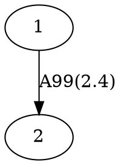

# <a href="https://marbl.github.io/MetagenomeScope/"></a> MetagenomeScope

<div align="center">
<a href="https://github.com/marbl/MetagenomeScope/actions/workflows/main.yml"></a>
<a href="https://codecov.io/gh/marbl/MetagenomeScope"></a>
</div>

MetagenomeScope is an interactive visualization tool designed for (meta)genome
assembly graphs.

This version of the tool is still a work in progress; more to come soon.

## Installation

Using [mamba](https://mamba.readthedocs.io/):

```bash
mamba create -n mgsc -c conda-forge "python >= 3.8" pygraphviz
mamba activate mgsc
pip install git+https://github.com/marbl/MetagenomeScope.git
```

(... Eventually we'll put this on bioconda or something.)

## Usage

Activate the mamba environment we just created and run:

```
mgsc -g graph.gfa
```

... where `graph.gfa` is a path to the assembly graph you want to visualize
(see information below on supported graph filetypes).

This will start a server using Dash.
The port number of the server defaults to `8050`, so navigate
to `localhost:8050` in a web browser to access the visualization.

### All command-line options

```
Usage: mgsc [OPTIONS]

  Visualizes an assembly graph.

  Please check out https://github.com/marbl/MetagenomeScope if you have any
  questions, suggestions, etc. about this tool.

Options:
  -g, --graph FILE          In GFA, FASTG, DOT, GML, or LastGraph format.  [required]
  -a, --agp FILE            AGP file describing paths (e.g. scaffolds) in the graph.
  -p, --port INTEGER RANGE  Server port number.  [default: 8050; 1024<=x<=65535]
  --verbose / --no-verbose  Log extra details.  [default: no-verbose]
  --debug / --no-debug      Use Dash's debug mode.  [default: no-debug]
  -v, --version             Show the version and exit.
  -h, --help                Show this message and exit.
```

### Supported assembly graph filetypes

<!-- TODO: I haven't tested miniasm, hifiasm(-meta), and MEGAHIT output graphs here;
should do that to verify that their graphs work ok -->

| Filetype | Tools that output this filetype | Notes |
| -------- | ------------------------------- | ----- |
| [GFA](https://gfa-spec.github.io/GFA-spec/) (`.gfa`) | [(meta)Flye](https://github.com/mikolmogorov/Flye), [LJA](https://github.com/AntonBankevich/LJA), [miniasm](https://github.com/lh3/miniasm), [hifiasm](https://github.com/chhylp123/hifiasm), [hifiasm-meta](https://github.com/xfengnefx/hifiasm-meta), ... | Both GFA v1 and GFA v2 files are accepted, but [currently](https://github.com/marbl/MetagenomeScope/issues/147) only the raw structure (segments and links) are included. |
| [FASTG](https://github.com/fedarko/pyfastg#the-fastg-file-format) (`.fastg`) | [SPAdes](https://cab.spbu.ru/software/spades/), [MEGAHIT](https://github.com/voutcn/megahit) | Expects SPAdes-"dialect" FASTG files. See [pyfastg's documentation](https://github.com/fedarko/pyfastg) for details. |
| [DOT](https://en.wikipedia.org/wiki/DOT_(graph_description_language)) (`.dot`, `.gv`) | [(meta)Flye](https://github.com/mikolmogorov/Flye), [LJA](https://github.com/AntonBankevich/LJA) | Expects DOT files produced by Flye or LJA. See "What filetype should I use for de Bruijn graphs?" in the FAQs below. |
| [GML](https://networkx.org/documentation/stable/reference/readwrite/gml.html) (`.gml`) | [MetaCarvel](https://github.com/marbl/MetaCarvel) | Expects MetaCarvel-"dialect" GML files. |
| [LastGraph](https://github.com/dzerbino/velvet/blob/master/Manual.pdf) (`.LastGraph`) | [Velvet](https://github.com/dzerbino/velvet) | Only the raw structure (nodes and arcs) are included. |

Should you run into [additional](https://xkcd.com/927/) assembly graph filetypes you'd like us to
support, feel free to open a GitHub issue.

## FAQs

### Reverse-complementary sequences

<!-- use of <strong> here was stolen from strainflye's readme, which in turn is
based on https://codedragontech.com/createwithcodedragon/how-to-style-html-details-and-summary-tags/ -->
<details>
  <summary><strong>FAQ 1. How do you handle reverse complement nodes/edges?</strong></summary>

The answer to this depends on the filetype of the graph you are using.

##### "Explicit" graph filetypes (FASTG, DOT, GML)

When MetagenomeScope reads in FASTG, DOT, and GML files,
it assumes that _these files explicitly describe all of the nodes and edges in the graph_.
So, let's say you give MetagenomeScope the following DOT file:



We will interpret this as a graph with **two nodes** (`1`, `2`) and **one edge**
(`1 -> 2`).

##### "Implicit" graph filetypes (GFA, LastGraph)

However, for GFA and LastGraph files, MetagenomeScope cannot make the
assumption that these files explicitly describe all of the nodes and edges in
the graph. In these files, each declaration of a node / edge
(in GFA parlance, "segment" / "link"; in LastGraph parlance, "node"
/ "arc") also declares this node / edge's reverse complement.

So, let's say you give MetagenomeScope the following GFA file (based on
[this example](https://github.com/sjackman/gfalint/blob/master/examples/sample1.gfa)):

```gfa
H	VN:Z:1.0
S	1	CGATGCAA
S	2	TGCAAAGTAC
L	1	+	2	+	5M
```

We will interpret this as a graph with **four nodes** (`1`, `-1`, `2`, `-2`)
and **two edges** (`1 -> 2`, `-2 -> -1`). The presence of node `X`
["implies"](https://github.com/bcgsc/abyss/wiki/ABySS-File-Formats#reverse-complement)
the existence of the reverse complement node `-X`, and the presence of edge
`X -> Y` "implies" the existence of the reverse complement edge `-Y -> -X`.
Interpreting the graph file in this way is analogous to
[how "double mode" works in Bandage](https://github.com/rrwick/Bandage/wiki/Single-vs-double-node-style).

##### Based on the FASTG specification, shouldn't FASTG be an "implicit" instead of an "explicit" filetype?

It's complicated. The way I interpret the FASTG specification, each declaration
of an edge sequence implicitly also declares this edge sequence's reverse complement; however,
this is not the case for "adjacencies" between edge sequences.

In any case, the "dialect" of FASTG files produced by SPAdes and MEGAHIT lists edge sequences
and their reverse complements (as well as adjacencies between edge sequences and their reverse complements)
separately. Because of this, we consider FASTG to be an "explicit" filetype.
(See [pyfastg's documentation](https://github.com/fedarko/pyfastg#about-reverse-complements)
for details on how we handle reverse complements in FASTG files.)
</details>

<details>
  <summary><strong>FAQ 2. Why does my graph have node <code>X</code> and <code>-X</code> in the same component?</strong></summary>

The short answer is "probably palindromes." Below is a more detailed answer.

##### Strand-separated components

Consider the following example GFA file from FAQ 1:

```gfa
H	VN:Z:1.0
S	1	CGATGCAA
S	2	TGCAAAGTAC
L	1	+	2	+	5M
```

There are four nodes and two edges in this graph, but they form two
[(weakly) connected components](https://en.wikipedia.org/wiki/Component_(graph_theory)) --
that is, the graph contains one "island" of `1` and `2` (which are connected to
each other), and another "island" of `-1` and `-2` (which are also connected to each other).
You can think of these entire components as "reverse complements" of each other:
although MetagenomeScope will visualize both of them
([at least right now](https://github.com/marbl/MetagenomeScope/issues/67)),
you don't really need to analyze them separately.
These "**strand-separated**" components describe the same
(or [mostly the same](https://github.com/rrwick/Bandage/wiki/Assembler-differences#velvet))
sequences, just in different directions.

##### Strand-mixed components

Sometimes a node and its reverse complement will end up
being in the same component,
due to things like [palindromic](https://en.wikipedia.org/wiki/Palindromic_sequence) sequences
gluing them together. The following GFA file is the same as the one we just saw,
but it now contains an extra "link" line from `1` to `-2`:

```gfa
H	VN:Z:1.0
S	1	CGATGCAA
S	2	TGCAAAGTAC
L	1	+	2	+	5M
L	1	+	2	-	0M
```

This graph contains four edges: `1 -> 2` and `-2 -> -1` (which we've already seen),
and `1 -> -2` and `2 -> -1`. The introduction of these last two edges has caused
the graph to become a single "strand-mixed" component, containing both
a node `X` and its reverse-complementary node `-X`.

This often happens with the big ("hairball") component in an assembly graph.
</details>

<details>
  <summary><strong>FAQ 3. What happens if an edge is its own reverse complement?</strong></summary>

(This assumes that you have read FAQ 1.)

This can happen if an edge exists from `X -> -X` or from `-X -> X` in an
"implicit" graph file (GFA / LastGraph). Consider
[this GFA file](https://github.com/sjackman/assembly-graph/blob/master/loop.gfa),
c/o Shaun Jackman:

```gfa
H	VN:Z:1.0
S	1	AAA
S	2	ACG
S	3	CAT
S	4	TTT
L	1	+	1	+	2M
L	2	+	2	-	2M
L	3	-	3	+	2M
L	4	-	4	-	2M
```

Since this GFA file contains four "link" lines, we might think at first that the corresponding graph
contains 4 × 2 = 8 edges. However, the graph only contains **6 unique
edges**. This is because the reverse complement of `2 -> -2` is itself:
we know from above that `X -> Y` implies `-Y -> -X`, but
`-(-2) -> -(2)` is equal to `2 -> -2`! The same goes for `-3 -> 3`:
`-(3) -> -(-3)` is equal to `-3 -> 3`.
Both of these edges "imply" themselves as their own reverse complements!

How do we handle this situation? As of writing,
when MetagenomeScope visualizes these graphs it will only draw one copy
of these "self-implying" edges. This matches
[the original visualization of this graph](https://github.com/sjackman/assembly-graph/blob/master/loop.gv.png), and also matches Bandage's visualization of this GFA file.

Notably, since we assume that "explicit" graph files (FASTG / DOT / GML)
explicitly define all of the nodes and edges in their graph, MetagenomeScope doesn't do anything
special for this case for these files. (If your DOT file describes one edge
from `X -> -X`, then that's fine; if it describes two or more edges from `X -> -X`,
then that's also fine, and we'll visualize all of them.)
</details>

### Graph structure

<details>
  <summary><strong>FAQ 4. What do you mean by a component's "size rank"?</strong></summary>

Given a graph with _N_ connected components: we sort these components by the number of
nodes they contain, from high to low. We then assign each of these components a
**size rank**, a number from 1 to _N_: the component with size rank #1 corresponds
to the largest component, and the component with size rank #_N_ corresponds to the
smallest component.

Often, we only care about looking at individual components in a graph -- laying out
and drawing the entire graph is not always a good idea when the graph is massive.
Component size ranks are a nice way of formalizing this.

Some details about component size ranks, if you are interested:

- The numbers shown in the treemap (accessible in the "Graph info" dialog)
  correspond exactly to component size ranks. So, the rectangle labelled
  #1 in the treemap corresponds to the largest component, the rectangle labelled
  #2 corresponds to the second-largest component, etc.

- The exact component sorting functionality accounts for ties by using four different sorting
  criteria, in the following order. Ties at one level cause later levels to be considered for
  breaking ties.
  - the number of "full" nodes in the component (treating a pair of split nodes 40-L → 40-R as a
    single node)
  - the number of "total" nodes in the component (treating a pair of split nodes 40-L → 40-R as
    two nodes)
  - the number of "total" edges in the component (including both real edges and "fake" edges
    between pairs of split nodes like 40-L → 40-R)
  - the number of patterns in the component

</details>

<details>
  <summary><strong>FAQ 5. Can my graphs have parallel edges?</strong></summary>

Yes! MetagenomeScope supports
[multigraphs](https://en.wikipedia.org/wiki/Multigraph). If your assembly graph
file describes more than one edge from `X -> Y`, then MetagenomeScope will
visualize all of these "parallel" edges. (This is mostly useful when visualizing
de Bruijn graphs.)

Notably, parallel edges are only supported right now for some filetypes. The
parsers MetagenomeScope uses for GFA and FASTG files
[do not allow multigraphs](https://github.com/marbl/MetagenomeScope/issues/239) -- this
means that, at the moment, trying to use MetagenomeScope to visualize a GFA or
FASTG file containing parallel edges will cause an error. I would like to address
this (at least for GFA files) at some point, but it doesn't seem like a very important issue.
</details>

<details>
  <summary><strong>FAQ 6. What filetype should I use for de Bruijn graphs?</strong></summary>

If you are using LJA (and probably also if you are using Flye), you may want to use a DOT file instead of a GFA / FASTG file as input.

This is because GFA and FASTG [are not ideal](https://github.com/AntonBankevich/LJA/blob/main/docs/jumbodbg_manual.md#output-of-de-bruijn-graph-construction) for representing graphs in which sequences are stored on edges rather than nodes (i.e. de Bruijn / repeat graphs). The DOT files output by Flye and LJA should contain the _original_ structure of these graphs (in which edges and nodes in the visualization actually correspond to edges and nodes in the original graph, respectively); the GFA / FASTG files usually represent altered versions in which nodes and edges have been swapped, which is not always an ideal representation.

That being said, please note that -- if you are using an assembler that outputs graphs in different
filetypes -- these files may have additional differences beyond the usual filetype differences.
For example, [Flye's GFA and DOT files can have slightly different coverages](https://github.com/mikolmogorov/Flye/issues/597),
since Flye produces them at different times in its pipeline.
</details>

## Development documentation

See [`CONTRIBUTING.md`](https://github.com/marbl/MetagenomeScope/blob/main/CONTRIBUTING.md).

## License

MetagenomeScope is licensed under the
[GNU GPL, version 3](https://www.gnu.org/copyleft/gpl.html).

MetagenomeScope's code is distributed with [Bootstrap](https://getbootstrap.com/) and [Bootstrap Icons](https://icons.getbootstrap.com/). Please see the [`metagenomescope/assets/vendor/licenses/`](https://github.com/marbl/MetagenomeScope/tree/main/metagenomescope/assets/vendor/licenses/) directory for copies of these tools' licenses.

## Acknowledgements

Thanks to various people in the Pop, Knight, and Pevzner Labs over the years for feedback and suggestions on the tool.

## Contact

Please [open a GitHub issue](https://github.com/marbl/MetagenomeScope/issues) if you have any questions or suggestions.
