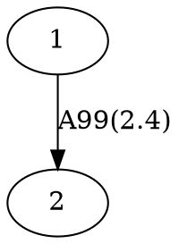

# MetagenomeScope

[](https://github.com/marbl/MetagenomeScope/actions/workflows/python.yml)
[](https://github.com/marbl/MetagenomeScope/actions/workflows/js.yml)
[](https://codecov.io/gh/marbl/MetagenomeScope)


<div align="center">
(Assembly graph based on Fig. 2(a) in Nijkamp et al. 2013.)
</div>

## NOTE: MetagenomeScope is currently being refactored!
Some features that were previously in MetagenomeScope are not currently
re-implemented yet -- this should be changed soon. Thanks for bearing with me
as I work on improving this, and please let me know if you have any questions.

## Summary

MetagenomeScope is an interactive visualization tool designed for metagenomic
sequence assembly graphs. The tool aims to display a [hierarchical
layout](https://en.wikipedia.org/wiki/Layered_graph_drawing) of the input graph
while emphasizing the presence of small-scale details that can correspond to
interesting biological features in the data.

To this end, MetagenomeScope
highlights certain "structural patterns" of contigs in the graph (repeating the
pattern identification hierarchically),
splits the graph into its connected components (by default only displaying one
connected component at a time),
and uses [Graphviz](https://www.graphviz.org/)'
[`dot`](https://www.graphviz.org/pdf/dotguide.pdf) tool to hierarchically
lay out each connected component of the graph.

MetagenomeScope also contains many other features intended to simplify
exploratory analysis of assembly graphs, including tools for scaffold
visualization, path finishing, and coloring nodes by biological metadata (e.g.
GC content). (As mentioned above, many of these features are not available in
the current version yet.)

## Installation

Probably the easiest way to install MetagenomeScope is using a
[conda](https://docs.conda.io/en/latest/) environment. Eventually we'll put
this up on bioconda or something, but until then you can use the following
steps:

```bash
# Download the YAML file describing the conda packages we'll install
wget https://raw.githubusercontent.com/marbl/MetagenomeScope/main/environment.yml

# Create a new conda environment based on this YAML file
# (by default, it'll be named "mgsc")
conda env create -f environment.yml

# Activate this conda environment
conda activate mgsc

# Install the actual MetagenomeScope software
pip install git+https://github.com/marbl/MetagenomeScope.git
```

### Troubleshooting your installation

Getting Graphviz and PyGraphviz installed -- and getting them to communicate
with each other -- can be tricky. I'm looking into ways of making this less
painful; for now, if you run into problems, please feel free to [contact
me](#contact) and I'll try to help out.

## Visualizing an assembly graph

Assuming you are currently in the conda environment we just created,
visualizing an assembly graph can be done in one command:

```
mgsc -i [path to your assembly graph] -o [output directory name]
```

The output directory will contain an `index.html` file that can be opened in
most modern web browsers. (The file points to other resources within the
directory, so please don't move it out of the directory.)

### What types of assembly graphs can this tool visualize?

Currently, MetagenomeScope supports the following filetypes:

<!-- TODO: I haven't tested miniasm, hifiasm(-meta), and MEGAHIT output graphs here;
should do that to verify that their graphs work ok -->

| Filetype | Tools that output this filetype | Notes |
| -------- | ------------------------------- | ----- |
| [GFA](https://gfa-spec.github.io/GFA-spec/) (`.gfa`) | [(meta)Flye](https://github.com/fenderglass/Flye), [LJA](https://github.com/AntonBankevich/LJA), [miniasm](https://github.com/lh3/miniasm), [hifiasm](https://github.com/chhylp123/hifiasm), [hifiasm-meta](https://github.com/xfengnefx/hifiasm-meta), ... | Both GFA v1 and GFA v2 files are accepted, but [currently](https://github.com/marbl/MetagenomeScope/issues/147) only the raw structure (segments and links) are included. |
| FASTG (`.fastg`) | [SPAdes](https://cab.spbu.ru/software/spades/), [MEGAHIT](https://github.com/voutcn/megahit) | Expects SPAdes-"dialect" FASTG files: see [pyfastg's documentation](https://github.com/fedarko/pyfastg) for details. |
| [DOT](https://en.wikipedia.org/wiki/DOT_(graph_description_language)) (`.dot`, `.gv`) | [(meta)Flye](https://github.com/fenderglass/Flye), [LJA](https://github.com/AntonBankevich/LJA) | Expects DOT files produced by Flye or LJA. Visualizing DOT files (rather than the GFA files also produced by these assemblers) can be preferable because GFA and FASTG files [are not ideal](https://github.com/AntonBankevich/LJA/blob/main/docs/jumbodbg_manual.md#output-of-de-bruijn-graph-construction) for representing graphs in which sequences are stored on edges rather than nodes (e.g. de Bruijn graphs); the DOT files output by Flye and LJA should contain the _original_ structure of these graphs (in which edges and nodes in the visualization actually correspond to edges and nodes in the original graph, respectively). |
| [GML](https://networkx.org/documentation/stable/reference/readwrite/gml.html) (`.gml`) | [MetaCarvel](https://github.com/marbl/MetaCarvel) | Expects MetaCarvel-"dialect" GML files. |
| [LastGraph](https://github.com/dzerbino/velvet/blob/master/Manual.pdf) (`.LastGraph`) | [Velvet](https://github.com/dzerbino/velvet) | Only the raw structure (nodes and arcs) are included. |

If you run into any additional assembly graph filetypes you'd like us to
support, please [let us know](#contact)!

## Demos

Some early demos are available online. We'll probably add more of these in the
future.

- [Marygold Fig. 2(a) graph](https://marbl.github.io/MetagenomeScope/demos/marygold/index.html)
  - See [Nijkamp et al. 2013](https://www.ncbi.nlm.nih.gov/pmc/articles/PMC3916741/) for details.
    This graph was based on the topology shown in Fig. 2(a) of this paper.

- [Velvet E. coli graph](https://marbl.github.io/MetagenomeScope/demos/bandage-ecoli-example/index.html)
  - This graph is example data from the website of [Bandage](http://rrwick.github.io/Bandage/)
    (which is another great tool for visualizing assembly graphs :)

## Details

<!-- use of <strong> here was stolen from strainflye's readme, which in turn is
based on https://codedragontech.com/createwithcodedragon/how-to-style-html-details-and-summary-tags/ -->
<details>
  <summary><strong>What's the deal with "reverse complement" nodes/edges?</strong></summary>

#### "Explicit" graph filetypes (FASTG, DOT, GML)

To make a long story short: when MetagenomeScope reads in FASTG, DOT, and GML files,
it assumes that _these files explicitly describe all of the nodes and edges in the graph_.
So, let's say you give MetagenomeScope the following LJA-style DOT file:



We will interpret this as a graph with **two nodes** (`1`, `2`) and **one edge**
(`1 -> 2`).

#### "Implicit" graph filetypes (GFA, LastGraph)

However, for GFA and LastGraph files, MetagenomeScope cannot make the
assumption that these files explicitly describe all of the nodes and edges in
the graph. When we read in these files, we assume that each node
and edge (in GFA parlance, "segment" and "link"; in LastGraph parlance, "node"
and "arc") has a reverse complement. So, let's say you give MetagenomeScope the
following GFA file (based on
[this example](https://github.com/sjackman/gfalint/blob/master/examples/sample1.gfa)):

```gfa
H	VN:Z:1.0
S	1	CGATGCAA
S	2	TGCAAAGTAC
L	1	+	2	+	5M
```

We will interpret this as a graph with **four nodes** (`1`, `-1`, `2`, `-2`)
and **two edges** (`1 -> 2`, `-2 -> -1`). The presence of node `X`
["implies"](https://github.com/bcgsc/abyss/wiki/ABySS-File-Formats#reverse-complement)
the existence of the reverse complement node `-X`, and the presence of edge
`X -> Y` "implies" the existence of the reverse complement edge `-Y -> -X`.
This is analogous to [how "double mode" works in Bandage](https://github.com/rrwick/Bandage/wiki/Single-vs-double-node-style).

#### Impacts of reverse-complement nodes / edges on the graph structure

Often, the presence of reverse-complement nodes / edges (whether
they are explicitly described in a FASTG, DOT, or GML file, or are implicitly
described in a GFA or LastGraph file) doesn't impact the graph structure much.

What does this mean? Consider the GFA example above. There are four nodes and
two edges in this graph, but they form two
[(weakly) connected components](https://en.wikipedia.org/wiki/Component_(graph_theory)) --
that is, the graph contains one "island" of `1` and `2` (which are connected to
each other), and another "island" of `-1` and `-2` (which are also connected to each other).
You can think of these entire components as "reverse complements" of each other:
although MetagenomeScope will visualize both of them
([at least right now](https://github.com/marbl/MetagenomeScope/issues/67)),
you don't really need to analyze them separately. They describe the same
sequences, just in different directions.\*

_This is not always the case_, though. Sometimes a node and its reverse
complement may wind up in the same component, for example in the following GFA
file (which contains an extra "link" line relative to the GFA file we
considered above):

```gfa
H	VN:Z:1.0
S	1	CGATGCAA
S	2	TGCAAAGTAC
L	1	+	2	+	5M
L	1	+	2	-	2D1M
```

This graph (still containing **four nodes** [`1`, `-1`, `2`, `-2`], but now
containing **four edges** [`1 -> 2`, `-2 -> -1`, `1 -> -2`, `2 -> -1`]) takes up only a single
weakly connected component.

\* The statement that reverse complements "describe the same sequences, just in
different directions" is technically not true for LastGraph files. Consider a node `N` in a
LastGraph file: the sequence represented by `N` will not be exactly equal to the reverse
complement of the sequence represented by `-N`, since these sequences are slightly
shifted. See
[the Bandage wiki](https://github.com/rrwick/Bandage/wiki/Assembler-differences#velvet)
for a nice figure and explanation. (That being said, the intuition for
"thinking about reverse-complement nodes / edges" here is pretty much the same
as it is for other files.)
</details>

<details>
  <summary><strong>What happens if an edge is its own reverse complement?</strong></summary>

You really like asking hard questions, don't you? ;)

This can happen if an edge exists from `X -> -X` or from `-X -> X` in an
"implicit" graph file (GFA / LastGraph). Consider
[this GFA file](https://github.com/sjackman/assembly-graph/blob/master/loop.gfa),
c/o Shaun Jackman:

```gfa
H	VN:Z:1.0
S	1	AAA
S	2	ACG
S	3	CAT
S	4	TTT
L	1	+	1	+	2M
L	2	+	2	-	2M
L	3	-	3	+	2M
L	4	-	4	-	2M
```

Since this GFA file contains four "link" lines, we might think at first that the corresponding graph
contains 4 × 2 = 8 edges. However, the graph only contains **6 unique
edges**. This is because the reverse complement of `2 -> -2` is itself:
`-(-2) -> -(2)` is equal to `2 -> -2`. The same goes for `-3 -> 3`:
`-(3) -> -(-3)` is equal to `-3 -> 3`.
Both of these edges "imply" themselves as their own reverse complements.

Currently: when MetagenomeScope visualizes these graphs, it will only draw one copy
of these "self-implying" edges. This matches
[the original visualization of this graph](https://github.com/sjackman/assembly-graph/blob/master/loop.gv.png), and also matches Bandage's visualization of this GFA file.

Notably, since we assume that "explicit" graph files (FASTG / DOT / GML)
explicitly define all of the nodes and edges in their graph, MetagenomeScope doesn't do anything
special for this case for these files. (If your DOT file describes one edge
from `X -> -X`, then that's fine; if it describes two edges from `X -> -X`,
then that's also fine.)
</details>

<details>
  <summary><strong>Can my graphs have parallel edges?</strong></summary>

Yes! MetagenomeScope now supports
[multigraphs](https://en.wikipedia.org/wiki/Multigraph). If your assembly graph
file describes more than one edge from `X -> Y`, then MetagenomeScope will
visualize all of these "parallel" edges. (This situation often occurs when
visualizing de Bruijn graphs stored in DOT files.)

Notably, this is only supported right now for some filetypes. The
parsers MetagenomeScope uses for GFA and FASTG files
[do not allow multigraphs](https://github.com/marbl/MetagenomeScope/issues/239) -- this
means that, at the moment, trying to use MetagenomeScope to visualize a GFA or
FASTG file containing parallel edges will cause an error. I hope to address
this (at least for GFA files) soon.
</details>

## License

MetagenomeScope is licensed under the
[GNU GPL, version 3](https://www.gnu.org/copyleft/gpl.html).

License information for MetagenomeScope's dependencies is included in the root directory of this repository, in `DEPENDENCY_LICENSES.txt`. License copies for dependencies distributed/linked with MetagenomeScope -- when not included with their corresponding source code -- are available in the `dependency_licenses/` directory.

## Acknowledgements

See the [acknowledgements page](https://github.com/marbl/MetagenomeScope/wiki/Acknowledgements) on the wiki for a list of acknowledgements
for MetagenomeScope's codebase.

## Contact

MetagenomeScope was created by members of the [Pop Lab](https://sites.google.com/a/cs.umd.edu/poplab/) in the [Center for Bioinformatics and Computational Biology](https://cbcb.umd.edu/) at the [University of Maryland, College Park](https://umd.edu/).

Feel free to email `mfedarko (at) ucsd (dot) edu` with any questions, suggestions, comments, concerns, etc. regarding the tool. You can also [open an issue](https://github.com/marbl/MetagenomeScope/issues) in this repository, if you'd like.
