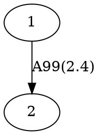

# <a href="https://marbl.github.io/MetagenomeScope/"></a> MetagenomeScope

<div align="center">
<a href="https://github.com/marbl/MetagenomeScope/actions/workflows/main.yml"></a>
<a href="https://codecov.io/gh/marbl/MetagenomeScope"></a>
</div>

MetagenomeScope is an interactive visualization tool designed for (meta)genome
assembly graphs.

MetagenomeScope iteratively decomposes the graph into interpretable structural patterns,
visualizes the graph using [hierarchical layout](https://en.wikipedia.org/wiki/Layered_graph_drawing),
and includes many helpful features for analyzing the graph at both large and small scales.

## Installation

Using [mamba](https://mamba.readthedocs.io/):

```bash
mamba create -n mgsc "python >= 3.8" numpy pygraphviz
mamba activate mgsc
pip install git+https://github.com/fedarko/MetagenomeScope-1.git@desk
```

... Eventually we'll put this on bioconda or something.

## Usage

Activate the mamba environment we just created and run:

```
mgsc -i [path to your assembly graph]
```

This will start a server using Dash. Navigate to `localhost:8050` in
a web browser to access the visualization.

## Supported filetypes

<!-- TODO: I haven't tested miniasm, hifiasm(-meta), and MEGAHIT output graphs here;
should do that to verify that their graphs work ok -->

| Filetype | Tools that output this filetype | Notes |
| -------- | ------------------------------- | ----- |
| [GFA](https://gfa-spec.github.io/GFA-spec/) (`.gfa`) | [(meta)Flye](https://github.com/mikolmogorov/Flye), [LJA](https://github.com/AntonBankevich/LJA), [miniasm](https://github.com/lh3/miniasm), [hifiasm](https://github.com/chhylp123/hifiasm), [hifiasm-meta](https://github.com/xfengnefx/hifiasm-meta), ... | Both GFA v1 and GFA v2 files are accepted, but [currently](https://github.com/marbl/MetagenomeScope/issues/147) only the raw structure (segments and links) are included. |
| [FASTG](https://github.com/fedarko/pyfastg#the-fastg-file-format) (`.fastg`) | [SPAdes](https://cab.spbu.ru/software/spades/), [MEGAHIT](https://github.com/voutcn/megahit) | Expects SPAdes-"dialect" FASTG files. See [pyfastg's documentation](https://github.com/fedarko/pyfastg) for details. |
| [DOT](https://en.wikipedia.org/wiki/DOT_(graph_description_language)) (`.dot`, `.gv`) | [(meta)Flye](https://github.com/mikolmogorov/Flye), [LJA](https://github.com/AntonBankevich/LJA) | Expects DOT files produced by Flye or LJA. See "What file format should I use for de Bruijn graphs?" in the FAQs below. |
| [GML](https://networkx.org/documentation/stable/reference/readwrite/gml.html) (`.gml`) | [MetaCarvel](https://github.com/marbl/MetaCarvel) | Expects MetaCarvel-"dialect" GML files. |
| [LastGraph](https://github.com/dzerbino/velvet/blob/master/Manual.pdf) (`.LastGraph`) | [Velvet](https://github.com/dzerbino/velvet) | Only the raw structure (nodes and arcs) are included. |

If there are [additional](https://xkcd.com/927/) assembly graph filetypes you'd like us to
support, feel free to open a GitHub issue.

## FAQs

(The title "FAQ" is kind of a lie because I don't think anyone has asked me any
of these questions yet. Maybe we can just act like the "F" in "FAQ" stands for
"future"?)

<!-- use of <strong> here was stolen from strainflye's readme, which in turn is
based on https://codedragontech.com/createwithcodedragon/how-to-style-html-details-and-summary-tags/ -->
<details>
  <summary><strong>How do you handle reverse complement nodes/edges?</strong></summary>

It's a bit involved. Let's go on a journey.

#### "Explicit" graph filetypes (FASTG, DOT, GML)

To make a long story short: when MetagenomeScope reads in FASTG, DOT, and GML files,
it assumes that _these files explicitly describe all of the nodes and edges in the graph_.
So, let's say you give MetagenomeScope the following DOT file:



We will interpret this as a graph with **two nodes** (`1`, `2`) and **one edge**
(`1 -> 2`).

#### "Implicit" graph filetypes (GFA, LastGraph)

However, for GFA and LastGraph files, MetagenomeScope cannot make the
assumption that these files explicitly describe all of the nodes and edges in
the graph: in these files, each declaration of a node / edge
(in GFA parlance, "segment" / "link"; in LastGraph parlance, "node"
/ "arc") also declares this node / edge's reverse complement.
So, let's say you give MetagenomeScope the following GFA file (based on
[this example](https://github.com/sjackman/gfalint/blob/master/examples/sample1.gfa)):

```gfa
H	VN:Z:1.0
S	1	CGATGCAA
S	2	TGCAAAGTAC
L	1	+	2	+	5M
```

We will interpret this as a graph with **four nodes** (`1`, `-1`, `2`, `-2`)
and **two edges** (`1 -> 2`, `-2 -> -1`). The presence of node `X`
["implies"](https://github.com/bcgsc/abyss/wiki/ABySS-File-Formats#reverse-complement)
the existence of the reverse complement node `-X`, and the presence of edge
`X -> Y` "implies" the existence of the reverse complement edge `-Y -> -X`.
Interpreting the graph file in this way is analogous to
[how "double mode" works in Bandage](https://github.com/rrwick/Bandage/wiki/Single-vs-double-node-style).

#### Impacts of reverse complement nodes / edges on the graph structure

Often, the presence of reverse complement nodes / edges (whether
they are explicitly described in a FASTG, DOT, or GML file, or are implicitly
described in a GFA or LastGraph file) **doesn't impact the graph structure much**.

What does this mean? Consider the GFA example above. There are four nodes and
two edges in this graph, but they form two
[(weakly) connected components](https://en.wikipedia.org/wiki/Component_(graph_theory)) --
that is, the graph contains one "island" of `1` and `2` (which are connected to
each other), and another "island" of `-1` and `-2` (which are also connected to each other).
You can think of these entire components as "reverse complements" of each other:
although MetagenomeScope will visualize both of them
([at least right now](https://github.com/marbl/MetagenomeScope/issues/67)),
you don't really need to analyze them separately. They describe the same
sequences, just in different directions.\*

_This is not always the case_, though. Sometimes a node and its reverse
complement may wind up in the same component, for example in the following GFA
file (which contains an extra "link" line relative to the GFA file we
considered above):

```gfa
H	VN:Z:1.0
S	1	CGATGCAA
S	2	TGCAAAGTAC
L	1	+	2	+	5M
L	1	+	2	-	2D1M
```

This graph (still containing **four nodes** [`1`, `-1`, `2`, `-2`], but now
containing **four edges** [`1 -> 2`, `-2 -> -1`, `1 -> -2`, `2 -> -1`]) takes up only a single
weakly connected component.

\* There may be some slight differences, depending on your assembler's behavior.
For example, in Velvet's output LastGraph files:
the sequence represented by a node `N` will not be exactly equal to the reverse
complement of the sequence represented by `-N`, since these sequences are slightly
shifted. See
[the Bandage wiki](https://github.com/rrwick/Bandage/wiki/Assembler-differences#velvet)
for a nice figure and explanation. (That being said, I think the intuition for
"thinking about reverse complement nodes / edges" here should be similar.)

#### Based on the FASTG specification, shouldn't FASTG be an "implicit" instead of an "explicit" filetype?

It's complicated. The way I interpret the FASTG specification, each declaration
of an edge sequence implicitly also declares this edge sequence's reverse complement; however,
this is not the case for "adjacencies" between edge sequences.

In any case, the "dialect" of FASTG files produced by SPAdes and MEGAHIT lists edge sequences
and their reverse complements (as well as adjacencies between edge sequences and their reverse complements)
separately. Because of this, we consider FASTG to be an "explicit" filetype.
(See [pyfastg's documentation](https://github.com/fedarko/pyfastg#about-reverse-complements)
for details on how we handle reverse complements in FASTG files.)
</details>

<details>
  <summary><strong>What happens if an edge is its own reverse complement?</strong></summary>

(This FAQ assumes that you read the one above it.)

This can happen if an edge exists from `X -> -X` or from `-X -> X` in an
"implicit" graph file (GFA / LastGraph). Consider
[this GFA file](https://github.com/sjackman/assembly-graph/blob/master/loop.gfa),
c/o Shaun Jackman:

```gfa
H	VN:Z:1.0
S	1	AAA
S	2	ACG
S	3	CAT
S	4	TTT
L	1	+	1	+	2M
L	2	+	2	-	2M
L	3	-	3	+	2M
L	4	-	4	-	2M
```

Since this GFA file contains four "link" lines, we might think at first that the corresponding graph
contains 4 × 2 = 8 edges. However, the graph only contains **6 unique
edges**. This is because the reverse complement of `2 -> -2` is itself:
we know from above that `X -> Y` implies `-Y -> -X`, but
`-(-2) -> -(2)` is equal to `2 -> -2`! The same goes for `-3 -> 3`:
`-(3) -> -(-3)` is equal to `-3 -> 3`.
Both of these edges "imply" themselves as their own reverse complements!

How do we handle this situation? As of writing,
when MetagenomeScope visualizes these graphs it will only draw one copy
of these "self-implying" edges. This matches
[the original visualization of this graph](https://github.com/sjackman/assembly-graph/blob/master/loop.gv.png), and also matches Bandage's visualization of this GFA file.

Notably, since we assume that "explicit" graph files (FASTG / DOT / GML)
explicitly define all of the nodes and edges in their graph, MetagenomeScope doesn't do anything
special for this case for these files. (If your DOT file describes one edge
from `X -> -X`, then that's fine; if it describes two or more edges from `X -> -X`,
then that's also fine, and we'll visualize all of them.)
</details>

<details>
  <summary><strong>Can my graphs have parallel edges?</strong></summary>

Yes! MetagenomeScope supports
[multigraphs](https://en.wikipedia.org/wiki/Multigraph). If your assembly graph
file describes more than one edge from `X -> Y`, then MetagenomeScope will
visualize all of these "parallel" edges. (This is mostly useful when visualizing
de Bruijn graphs.)

Notably, parallel edges are only supported right now for some filetypes. The
parsers MetagenomeScope uses for GFA and FASTG files
[do not allow multigraphs](https://github.com/marbl/MetagenomeScope/issues/239) -- this
means that, at the moment, trying to use MetagenomeScope to visualize a GFA or
FASTG file containing parallel edges will cause an error. I would like to address
this (at least for GFA files) at some point, but it doesn't seem like a very important issue.
</details>

<details>
  <summary><strong>What file format should I use for de Bruijn graphs?</strong></summary>

If you are using LJA (and probably also if you are using Flye), you may want to use a DOT file instead of a GFA / FASTG file as input.

This is because GFA and FASTG [are not ideal](https://github.com/AntonBankevich/LJA/blob/main/docs/jumbodbg_manual.md#output-of-de-bruijn-graph-construction) for representing graphs in which sequences are stored on edges rather than nodes (i.e. de Bruijn / repeat graphs). The DOT files output by Flye and LJA should contain the _original_ structure of these graphs (in which edges and nodes in the visualization actually correspond to edges and nodes in the original graph, respectively); the GFA / FASTG files usually represent mutated versions in which nodes and edges have been swapped, which is not always a perfect representation.
</details>

## License

MetagenomeScope is licensed under the
[GNU GPL, version 3](https://www.gnu.org/copyleft/gpl.html).

License information for MetagenomeScope's dependencies is included in the root directory of this repository, in `DEPENDENCY_LICENSES.txt`. License copies for dependencies distributed/linked with MetagenomeScope -- when not included with their corresponding source code -- are available in the `dependency_licenses/` directory.

## Acknowledgements

Thanks to various people in the Pop, Knight, and Pevzner Labs over the years for feedback and suggestions on the tool.

## Contact

Please [open a GitHub issue](https://github.com/marbl/MetagenomeScope/issues) if you have any questions or suggestions.
