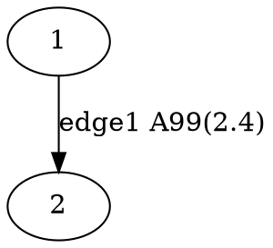

# <a href="https://marbl.github.io/MetagenomeScope/"></a> MetagenomeScope

<div align="center">
<a href="https://github.com/marbl/MetagenomeScope/actions/workflows/main.yml"></a>
<a href="https://codecov.io/gh/marbl/MetagenomeScope"></a>
<a href="https://pypi.org/project/metagenomescope"></a>
</div>

Interactive visualization tool for (meta)genome assembly graphs.

MetagenomeScope decomposes the graph into **structural patterns** and highlights
these as annotations on the graph. By default it lays out the graph [**hierarchically**](https://en.wikipedia.org/wiki/Layered_graph_drawing), using [Graphviz](https://graphviz.org/)' [_dot_](https://graphviz.org/docs/layouts/dot/) algorithm.

MetagenomeScope also contains various functionalities for visualizing assembly
graphs at larger scales -- for example, highlighting scaffold paths on the graph and
drawing summary plots of the graph's structure.

This tool is still a work in progress, so please let us know if you have any feedback!

## Screenshots

<table>
  <thead>
    <tr>
      <th>Stool metagenome assembly (<a href="https://github.com/marbl/MetaCarvel">MetaCarvel</a>)</th>
      <th>Yeast genome assembly (<a href="https://github.com/mikolmogorov/Flye">Flye</a>)</th>
    </tr>
  </thead>
  <tbody>
    <tr>
      <td></td>
      <td></td>
    </tr>
    <tr align="center">
      <td><i>Data source: <a href="https://www.ncbi.nlm.nih.gov/bioproject/?term=SRS049959">SRS049959</a></i></td>
      <td><i>Data source: <a href="https://github.com/almiheenko/AGB/tree/master/test_data/flye_yeast">AGB</a></i></td>
    </tr>
  </tbody>
</table>

<table>
  <thead>
    <tr>
      <th>Summarizing graph structure in a <a href="https://en.wikipedia.org/wiki/Treemapping">treemap</a></th>
      <th>Interactive charts of graph statistics</th>
    </tr>
  </thead>
  <tbody>
    <tr>
      <td></td>
      <td></td>
    </tr>
    <tr align="center">
      <td colspan="2"><i>Data source: <a href="https://www.ncbi.nlm.nih.gov/bioproject/?term=SRS049959">SRS049959</a></i></td>
    </tr>
  </tbody>
</table>

## Installation

Using [mamba](https://mamba.readthedocs.io/):

```bash
mamba create -n mgsc -c conda-forge "python >= 3.8" pygraphviz
mamba activate mgsc
pip install metagenomescope
```

(We plan to put this on bioconda soon.)

## Usage

Activate the mamba environment we just created and run:

```
mgsc -g graph.gfa
```

... where `graph.gfa` is a path to the assembly graph you want to visualize
(see information below on supported graph filetypes).

This will start a server using Dash.
The port number of the server defaults to `8050`, so navigate
to `localhost:8050` in a web browser to access the visualization.

### All command-line options

```
Usage: mgsc [OPTIONS]

  Visualizes an assembly graph.

  Please visit https://github.com/marbl/MetagenomeScope for more information.

Options:
  -g, --graph FILE          In GFA, FASTG, DOT, GML, or LastGraph format.  [required]
  -a, --agp FILE            AGP file describing paths (e.g. scaffolds) in the graph.
  -i, --info FILE           Flye assembly_info.txt file describing contigs/scaffolds.
  -p, --port INTEGER RANGE  Server port number.  [default: 8050; 1024<=x<=65535]
  --verbose / --no-verbose  Log extra details.  [default: no-verbose]
  --debug / --no-debug      Use Dash's debug mode.  [default: no-debug]
  -v, --version             Show the version and exit.
  -h, --help                Show this message and exit.
```

### Supported assembly graph filetypes

| Filetype | Generated by | Notes |
| -------- | ------------ | ----- |
| [GFA](https://gfa-spec.github.io/GFA-spec/) (`.gfa`) | [Flye](https://github.com/mikolmogorov/Flye), [LJA](https://github.com/AntonBankevich/LJA), [hifiasm](https://github.com/chhylp123/hifiasm), [verkko](https://github.com/marbl/verkko), ... | Both GFA 1 and GFA 2 files are accepted. [Currently](https://github.com/marbl/MetagenomeScope/issues/147) we visualize segments, links (GFA 1), non-containment edges (GFA 2), and paths of segments. |
| [FASTG](https://github.com/fedarko/pyfastg#the-fastg-file-format) (`.fastg`) | [SPAdes](https://github.com/ablab/spades), [MEGAHIT](https://github.com/voutcn/megahit) | [Expects](https://github.com/fedarko/pyfastg) FASTG files produced by SPAdes or MEGAHIT. |
| [DOT](https://en.wikipedia.org/wiki/DOT_(graph_description_language)) (`.dot`, `.gv`) | [Flye](https://github.com/mikolmogorov/Flye), [LJA](https://github.com/AntonBankevich/LJA) | Expects DOT files produced by Flye or LJA. See "What filetype should I use for de Bruijn graphs?" in the FAQs below. |
| [GML](https://networkx.org/documentation/stable/reference/readwrite/gml.html) (`.gml`) | [MetaCarvel](https://github.com/marbl/MetaCarvel) | Expects GML files produced by MetaCarvel. |
| [LastGraph](https://github.com/dzerbino/velvet/blob/master/Manual.pdf) (`.LastGraph`) | [Velvet](https://github.com/dzerbino/velvet) | [Currently](https://github.com/marbl/MetagenomeScope/issues/147) we just visualize the raw structure (nodes and arcs). |

Should you run into [additional](https://xkcd.com/927/) assembly graph filetypes you'd like us to
support, feel free to open a GitHub issue.

### Supported path filetypes

Paths can optionally be specified through any of the following inputs:

<details>
  <summary><strong>AGP files (<code>-a</code>)</strong></summary>

<hr/>

_See the [AGP specification](https://www.ncbi.nlm.nih.gov/genbank/genome_agp_specification/) for details._

**If your graph is in DOT format:**
  - We assume the `component_id`s in column 6a of the AGP file correspond to edge IDs.

**Otherwise:**
  - We assume the `component_id`s correspond to node IDs.

<hr/>
</details>

<details>
  <summary><strong>Flye <code>assembly_info.txt</code> files (<code>-i</code>)</strong></summary>

<hr/>

_See [Flye's documentation](https://github.com/mikolmogorov/Flye/blob/flye/docs/USAGE.md#output) for details._

**If your graph is in DOT format:**
  - We will visualize the edge-paths described in the `.txt` file.

**If your graph is in GFA format:**
  - The contigs in the GFA file should correspond to collapsed edge-paths in the `.txt` file, so we can't really visualize these edge-paths.

  - However, we will extract contig information from the `.txt` file (e.g. coverage) and show it in the interface as node data.

<hr/>
</details>

<details>
  <summary><strong>P-lines in GFA 1 files, or O-lines in GFA 2 files (<code>-g</code>)</strong></summary>

<hr/>

_See the [GFA 1](https://gfa-spec.github.io/GFA-spec/GFA1.html) and [GFA 2](https://gfa-spec.github.io/GFA-spec/GFA2.html) specifications for details._

[Currently](https://github.com/marbl/MetagenomeScope/issues/147), we only show segments on GFA paths (not edges, gaps, etc.)

<hr/>
</details>

## Structural patterns

MetagenomeScope detects and highlights five types of structural patterns on the graph:


### 1. Bubbles (and bulges)

**Bubbles** ([Miller _et al._, 2010](https://pmc.ncbi.nlm.nih.gov/articles/PMC2874646/); [Nijkamp _et al._, 2013](https://pmc.ncbi.nlm.nih.gov/articles/PMC3916741/)) follow a diverge-coverge pattern. They generally indicate variation -- either real (e.g. an alternate path is caused by a SNP) or erroneous (e.g. an alternate path is caused by a sequencing error). We identify bubbles using a modified version of the algorithm given in [Onodera _et al._, 2013](https://link.springer.com/chapter/10.1007/978-3-642-40453-5_26).

Similarly, **bulges** ([Pevzner _et al._, 2004](https://pmc.ncbi.nlm.nih.gov/articles/PMC515325/); [Vasilinetc _et al._, 2015](https://academic.oup.com/bioinformatics/article/31/20/3262/195494)) are pairs of nodes where there exist multiple parallel edges from one node to another.

Bulges can typically be interpreted the same way as bubbles -- you generally see bulges in "edge-centric" (e.g. de Bruijn) graphs, and bubbles in "node-centric" (e.g. overlap) graphs. So, we label both bubbles and bulges identically.

### 2. Frayed ropes

**Frayed ropes** ([Miller _et al._, 2010](https://pmc.ncbi.nlm.nih.gov/articles/PMC2874646/)) follow a converge-diverge pattern; they have the opposite structure as bubbles. They generally indicate interspersed repeats in the middle region.

### 3 and 4. Chains and cyclic chains

**Chains** are just non-branching paths of at least two nodes. **Cyclic chains** are chains where the end node has an outgoing edge to the start node.
Cyclic chains represent a simpler form of what are known in de Bruijn graphs as _whirl_ structures ([Pevzner _et al._, 2004](https://pmc.ncbi.nlm.nih.gov/articles/PMC515325/)).

### 5. Bipartites

**Bipartites** are regions of the graph that can be partitioned into two layers of nodes (let's call them _Left_ and _Right_), such that:

- _Left_ contains at least two nodes
- _Right_ contains at least two nodes
- All nodes in _Left_ have exactly one edge to all nodes in _Right_
- All nodes in _Left_ have no additional outgoing edges
- All nodes in _Right_ have exactly one incoming edge from all nodes in _Left_
- All nodes in _Right_ have no additional incoming edges
- There are no cycles within the subgraph of _Left_ and _Right_ (e.g. no nodes in _Right_ can have an edge to any node in _Left_)

Surprisingly, these kinds of patterns tend to pop up a lot in certain graphs! These are less well-documented in the literature than other types of patterns, but our suspicion is that these are another indication (like frayed ropes) of repeats.

## Example datasets

### Flye (DOT file, 61 nodes, 122 edges): _S. cerevisiae_ (yeast)

This data is from [AGB's GitHub repository](https://github.com/almiheenko/AGB/tree/master/test_data/flye_yeast).

```bash
wget https://raw.githubusercontent.com/marbl/MetagenomeScope/refs/heads/main/metagenomescope/tests/input/flye_yeast.gv
wget https://raw.githubusercontent.com/marbl/MetagenomeScope/refs/heads/main/metagenomescope/tests/input/flye_yeast_assembly_info.txt
mgsc -g flye_yeast.gv -i flye_yeast_assembly_info.txt
```

### Velvet (LastGraph file, 558 nodes, 664 edges): _E. coli_

This is an example graph from [Bandage](http://rrwick.github.io/Bandage/).
Note that the original sequences have been removed to save space.

```bash
wget https://raw.githubusercontent.com/marbl/MetagenomeScope/refs/heads/main/metagenomescope/tests/input/E_coli_LastGraph
mgsc -g E_coli_LastGraph
```

### Hodgepodge of other test datasets

See the [`metagenomescope/tests/input/`](https://github.com/marbl/MetagenomeScope/tree/main/metagenomescope/tests/input)
directory.

## FAQs

### Reverse-complementary sequences

<!-- use of <strong> here was stolen from strainflye's readme, which in turn is
based on https://codedragontech.com/createwithcodedragon/how-to-style-html-details-and-summary-tags/ -->
<details>
  <summary><strong>FAQ 1. How do you handle reverse-complementary nodes/edges?</strong></summary>

<hr/>

The answer to this depends on the filetype of the graph you are using.

##### "Explicit" graph filetypes (FASTG, DOT, GML)

When MetagenomeScope reads in FASTG, DOT, and GML files,
it assumes that _these files explicitly describe all of the nodes and edges in the graph_.
So, let's say you give MetagenomeScope the following DOT file:



We will interpret this as a graph with **two nodes** (`1`, `2`) and **one edge**
(`1 -> 2`).

##### "Implicit" graph filetypes (GFA, LastGraph)

However, for GFA and LastGraph files, MetagenomeScope cannot make the
assumption that these files explicitly describe all of the nodes and edges in
the graph. In these files, each declaration of a node / edge
(in GFA parlance, "segment" / "link"; in LastGraph parlance, "node"
/ "arc") also declares this node / edge's reverse complement.

So, let's say you give MetagenomeScope the following GFA file (based on
[this example](https://github.com/sjackman/gfalint/blob/master/examples/sample1.gfa)):

```gfa
H	VN:Z:1.0
S	1	CGATGCAA
S	2	TGCAAAGTAC
L	1	+	2	+	5M
```

We will interpret this as a graph with **four nodes** (`1`, `-1`, `2`, `-2`)
and **two edges** (`1 -> 2`, `-2 -> -1`). The presence of node `X`
["implies"](https://github.com/bcgsc/abyss/wiki/ABySS-File-Formats#reverse-complement)
the existence of the reverse complement node `-X`, and the presence of edge
`X -> Y` "implies" the existence of the reverse complement edge `-Y -> -X`.
Interpreting the graph file in this way is analogous to
[how "double mode" works in Bandage](https://github.com/rrwick/Bandage/wiki/Single-vs-double-node-style).

##### Based on the FASTG specification, shouldn't FASTG be an "implicit" instead of an "explicit" filetype?

It's complicated. The way I interpret the FASTG specification, each declaration
of an edge sequence implicitly also declares this edge sequence's reverse complement; however,
this is not the case for "adjacencies" between edge sequences.

In any case, the "dialect" of FASTG files produced by SPAdes and MEGAHIT lists edge sequences
and their reverse complements (as well as adjacencies between edge sequences and their reverse complements)
separately. Because of this, we consider FASTG to be an "explicit" filetype.
(See [pyfastg's documentation](https://github.com/fedarko/pyfastg#about-reverse-complements)
for details on how we handle reverse complements in FASTG files.)
<hr/>
</details>

<details>
  <summary><strong>FAQ 2. Why does my graph have node <code>X</code> and <code>-X</code> in the same component?</strong></summary>

<hr/>

One common reason this happens is the presence of [palindromic](https://en.wikipedia.org/wiki/Palindromic_sequence) sequences:
these can cause both a sequence and its reverse-complement to be connected to
each other.

This often occurs with the big ("hairball") component in an assembly graph.
<hr/>
</details>

<details>
  <summary><strong>FAQ 3. What happens if an edge is its own reverse complement?</strong></summary>

<hr/>

(This assumes that you have read FAQ 1.)

This can happen if an edge exists from `X -> -X` or from `-X -> X` in an
"implicit" graph file (GFA / LastGraph). Consider
[this GFA file](https://github.com/sjackman/assembly-graph/blob/master/loop.gfa):

```gfa
H	VN:Z:1.0
S	1	AAA
S	2	ACG
S	3	CAT
S	4	TTT
L	1	+	1	+	2M
L	2	+	2	-	2M
L	3	-	3	+	2M
L	4	-	4	-	2M
```

Since this GFA file contains four "link" lines, we might think at first that the corresponding graph
contains 4 × 2 = 8 edges. However, the graph only contains **6 unique
edges**. This is because the reverse complement of `2 -> -2` is itself:
we know from above that `X -> Y` implies `-Y -> -X`, but
`-(-2) -> -(2)` is equal to `2 -> -2`! The same goes for `-3 -> 3`:
`-(3) -> -(-3)` is equal to `-3 -> 3`.
Both of these edges "imply" themselves as their own reverse complements!

How do we handle this situation? As of writing,
when MetagenomeScope visualizes these graphs it will only draw one copy
of these "self-implying" edges. This matches
[the original visualization of this graph](https://github.com/sjackman/assembly-graph/blob/master/loop.gv.png), and also matches Bandage's visualization of this GFA file.

Notably, since we assume that "explicit" graph files (FASTG / DOT / GML)
explicitly define all of the nodes and edges in their graph, MetagenomeScope doesn't do anything
special for this case for these files. (If your DOT file describes one edge
from `X -> -X`, then that's fine; if it describes two or more edges from `X -> -X`,
then that's also fine, and we'll visualize all of them.)
<hr/>
</details>

### Graph structure

<details>
  <summary><strong>FAQ 4. What do you mean by a component's "size rank"?</strong></summary>

<hr/>

Given a graph with _N_ connected components: we sort these components by the number of
nodes they contain, from high to low. We then assign each of these components a
**size rank**, a number from 1 to _N_: the component with size rank #1 corresponds
to the largest component, and the component with size rank #_N_ corresponds to the
smallest component.

Often, we only care about looking at individual components in a graph -- laying out
and drawing the entire graph is not always a good idea when the graph is massive.
Component size ranks are a nice way of formalizing this.

Some details about component size ranks, if you are interested:

- The numbers shown in the treemap (accessible in the "Graph info" dialog)
  correspond exactly to component size ranks. So, the rectangle labelled
  #1 in the treemap corresponds to the largest component, the rectangle labelled
  #2 corresponds to the second-largest component, etc.

- The exact component sorting functionality accounts for ties by using four different sorting
  criteria, in the following order. Ties at one level cause later levels to be considered for
  breaking ties.
  - the number of "full" nodes in the component (treating a pair of split nodes 40-L → 40-R as a
    single node)
  - the number of "total" nodes in the component (treating a pair of split nodes 40-L → 40-R as
    two nodes)
  - the number of "total" edges in the component (including both real edges and "fake" edges
    between pairs of split nodes like 40-L → 40-R)
  - the number of patterns in the component

<hr/>
</details>

<details>
  <summary><strong>FAQ 5. Can my graphs have parallel edges?</strong></summary>

<hr/>

Yes! MetagenomeScope supports
[multigraphs](https://en.wikipedia.org/wiki/Multigraph). If your assembly graph
file describes more than one edge from `X -> Y`, then MetagenomeScope will
visualize all of these "parallel" edges. (This is mostly useful when visualizing
de Bruijn graphs.)

Notably, parallel edges not supported right now for FASTG files. I don't think
I've ever seen any FASTG files that have parallel edges, so I don't think this
is a big priority, but
[please let me know if you would like us to add support for it](https://github.com/fedarko/pyfastg/issues/8).

<hr/>
</details>

<details>
  <summary><strong>FAQ 6. What filetype should I use for de Bruijn graphs?</strong></summary>

<hr/>

If you are visualizing output from LJA or Flye, you _may_ want to use a DOT file instead of a GFA / FASTG file as input.

This is because GFA and FASTG [are not ideal](https://github.com/AntonBankevich/LJA/blob/main/docs/jumbodbg_manual.md#output-of-de-bruijn-graph-construction) for representing graphs in which sequences are stored on edges rather than nodes (i.e. de Bruijn / repeat graphs). The DOT files output by Flye and LJA should contain the _original_ structure of these graphs (in which edges and nodes in the visualization actually correspond to edges and nodes in the original graph, respectively); the GFA / FASTG files usually represent altered versions in which nodes and edges have been swapped, which is not always an ideal representation (especially if you are doing something where you really care about the structure of the original graph).

That being said, please note that -- if you are using an assembler that outputs graphs in different
filetypes -- these files may have additional differences beyond the usual filetype differences.
For example, [Flye's GFA and DOT files can have slightly different coverages](https://github.com/mikolmogorov/Flye/issues/597),
since Flye produces them at different times in its pipeline.
<hr/>
</details>

### Filetypes

<details>
  <summary><strong>FAQ 7. I got an error saying <code>Custom record types are not supported in GFA1</code>?</strong></summary>

<hr/>

Some assemblers include additional kinds of lines in their output GFA files. For example,
hifiasm and hifiasm-meta include [`A`-lines describing alignments](https://github.com/chhylp123/hifiasm/issues/91).

These "custom" lines can cause problems when parsing these graphs, because they may not be technically
allowed in certain GFA versions.

The simplest way around this is just deleting or commenting out these custom lines. Here is an examle of commenting out the `A`-lines in hifiasm GFA files using `sed`:

```bash
sed -i -e 's/^A/#A/' hifiasm-out.p_ctg.gfa
```

[Eventually](https://github.com/marbl/MetagenomeScope/issues/310) I'd like to implement a better solution for this...

<hr/>
</details>

### Patterns

<details>
  <summary><strong>FAQ 8. How can I run the pattern decomposition process programmatically?</strong></summary>

<hr/>

Creating a `metagenomescope.graph.AssemblyGraph` object will automatically run the decomposition process:

```python
>>> from metagenomescope.graph import AssemblyGraph
>>> ag = AssemblyGraph("graph.gfa")  # replace with your graph's filepath
```

At this point:

- The "decomposed graph" (where patterns are collapsed into nodes) is represented by `ag.decomposed_graph` (a [NetworkX `MultiDiGraph`](https://networkx.org/documentation/stable/reference/classes/multidigraph.html)).

- The "original graph" (i.e. with all patterns fully uncollapsed, revealing all "original" nodes and edges) is represented by `ag.graph` (also a [NetworkX `MultiDiGraph`](https://networkx.org/documentation/stable/reference/classes/multidigraph.html))
  - Note that this graph will still include split nodes and fake edges, if any remain after the decomposition process.

- All nodes, edges, and patterns will have unique integer IDs. These IDs can be used to look up information about nodes, edges, and patterns in the `ag.nodeid2obj`, `ag.edgeid2obj`, and `ag.pattid2obj` dictionaries, respectively.

Some examples of analyzing the decomposition results:

```python
>>> from metagenomescope.graph import AssemblyGraph
>>> ag = AssemblyGraph("metagenomescope/tests/input/E_coli_LastGraph")
>>> # Inspect nodes, edges, and patterns
>>> ag.nodeid2obj
{0: Node 0 (name: 1),
 1: Node 1 (name: -1),
 2: Node 2 (name: 2),
 ...}
>>> ag.edgeid2obj
{558: Edge 558 (orig: 0 -> 244; new: 0 -> 244; dec: 0 -> 1421),
 559: Edge 559 (orig: 1 -> 342; new: 1 -> 342; dec: 1527 -> 342),
 560: Edge 560 (orig: 2 -> 477; new: 2 -> 477; dec: 2 -> 477),
 ...}
>>> ag.pattid2obj
{1222: bubble1222 containing nodes [33, 283, 395, 39] from [33] to [39],
 1227: bubble1227 containing nodes [34, 76, 382, 303] from [34] to [76],
 1232: bubble1232 containing nodes [40, 43, 35, 501] from [35] to [43],
 ...}
>>> # Go through just the bubble patterns
>>> ag.bubbles
[bubble1222 containing nodes [33, 283, 395, 39] from [33] to [39],
 bubble1227 containing nodes [34, 76, 382, 303] from [34] to [76],
 bubble1232 containing nodes [40, 43, 35, 501] from [35] to [43],
 ...]
>>> # Look up a node by name (if a node was split, this will list both halves)
>>> ag.nodename2objs
defaultdict(<class 'list'>,
            {'1': [Node 0 (name: 1)],
             '-1': [Node 1 (name: -1)],
             '2': [Node 2 (name: 2)],
             ...
             '40-R': [Node 78 (name: 40-R)],
             '40': [Node 78 (name: 40-R), Node 1259 (name: 40-L)],
             '40-L': [Node 1259 (name: 40-L)],
             ...})
>>> # Examine split nodes
>>> for n in ag.nodeid2obj.values():
...     if n.split is not None:
...         print(n)
Node 32 (name: 17-L)
Node 33 (name: -17-R)
Node 34 (name: 18-R)
...
>>> # Distinguish fake from real edges
>>> for e in ag.edgeid2obj.values():
...     print(e, e.is_fake)
Edge 558 (orig: 0 -> 244; new: 0 -> 244; dec: 0 -> 1421) False
Edge 559 (orig: 1 -> 342; new: 1 -> 342; dec: 1527 -> 342) False
...
Edge*1634 (orig: 348 -> 1633; new: 348 -> 1633; dec: 1628 -> 1666) True
Edge*1639 (orig: 1638 -> 451; new: 1638 -> 451; dec: 1671 -> 1635) True
```

This interface should remain relatively stable, although I may change things slightly as development continues. If you have any questions, please reach out.

<hr/>
</details>

### Performance

<details>
  <summary><strong>FAQ 9. What's the biggest possible graph I can visualize?</strong></summary>

<hr/>

We're still figuring that out. There are two main bottlenecks I am aware of:

1. Laying out the graph.

    - We usually only lay out one component at a time, so generally the problem comes with laying out the large "hairball" component(s) of the graph, if any.

    - When you get to the order of, say, thousands of nodes, laying out a component will probably become somewhat slow (especially if you select the `Lay out patterns recursively` option in the draw options dialog).

    - To my understanding, a big factor here is the ratio of nodes to edges: when there are many more edges than nodes in a component (indicating a very densely connected structure), Graphviz has to do a lot of work to position things properly.

2. Drawing the graph's elements.

    - Cytoscape.js has a lot of optimizations built-in, but I think there are some inherent limitations of drawing using a HTML canvas.

    - With graphs containing thousands of nodes, interaction (e.g. zooming, panning) starts to feel a bit sluggish.


I have some ideas for dealing with these bottlenecks, but thankfully there are already ways around both of these issues. Some approaches that may be helpful:

- Assuming that your graph has multiple components, check out the `Components` tab in the `Graph info` dialog to see how big these components are. If component #1 (the largest one) contains more than, say, 10,000 nodes, you may want to start off with analyzing the smaller components.

- You don't need to draw entire components at once. Try using the `Around certain node(s)` drawing method (in the dropdown inside the `Draw` section): if you are interested in just certain neighborhood(s) in a massive component, you can enter in a list of nodes here (and some distance around them) and we'll just draw the corresponding neighborhoods. (Inspired by [Bandage](https://github.com/rrwick/bandage) :)

- Turning off labels might be helpful?

    - Although probably not by that much, since we already use Cytoscape.js' functionality to hide labels when you're zoomed out from the graph.

    - So... if you set a really big label font size and zoom the graph out really far, _then_ labels could cause performance issues.

<hr/>
</details>

## Known issues

- **Edge flattening:** Cytoscape.js (the library we use to visualize graphs in the browser)
  can sometimes [determine](https://github.com/cytoscape/cytoscape.js/issues/1451) that the
  control points used to draw certain [complex edges](https://js.cytoscape.org/#style/unbundled-bezier-edges)
  are invalid. This can happen as you adjust the visualization after drawing (e.g. by selecting
  nodes or moving them around).

  To prevent these "invalid" edges from being hidden, MetagenomeScope will detect them
  and "flatten" them into [simple Bezier edges](https://js.cytoscape.org/#style/bezier-edges)
  (usually straight lines). This way, we can at least draw _something_ for each edge in the graph.

- **Long graphs:** Graph layouts that form a long horizontal or vertical line may break Cytoscape.js'
  rendering process ([#262](https://github.com/marbl/MetagenomeScope/issues/262)). If this
  happens to you, you can refresh the page to get Cytoscape.js working again.

## Development documentation

See [`CONTRIBUTING.md`](https://github.com/marbl/MetagenomeScope/blob/main/CONTRIBUTING.md).

## License

MetagenomeScope is licensed under the
[GNU GPL, version 3](https://www.gnu.org/copyleft/gpl.html).

MetagenomeScope's code is distributed with [Bootstrap](https://getbootstrap.com/) and [Bootstrap Icons](https://icons.getbootstrap.com/). Please see the [`metagenomescope/assets/vendor/licenses/`](https://github.com/marbl/MetagenomeScope/tree/main/metagenomescope/assets/vendor/licenses/) directory for copies of these tools' licenses.

## Acknowledgements

Thanks to various people in the Pop, Knight, and Pevzner Labs over the years for their kind feedback and helpful suggestions.

Thanks also to the developers of the many excellent open-source software packages used by MetagenomeScope. In particular,
[Graphviz](https://graphviz.org/) (graph layout), [Cytoscape.js](https://js.cytoscape.org/) (interactive graph drawing), and
[Dash](https://dash.plotly.com/) (application framework) have been extremely helpful tools throughout the development of
this project.

## Contact

Please [open a GitHub issue](https://github.com/marbl/MetagenomeScope/issues) if you have any questions or suggestions.
